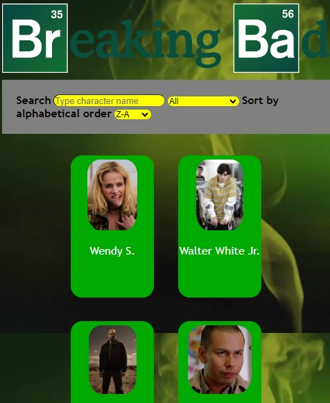
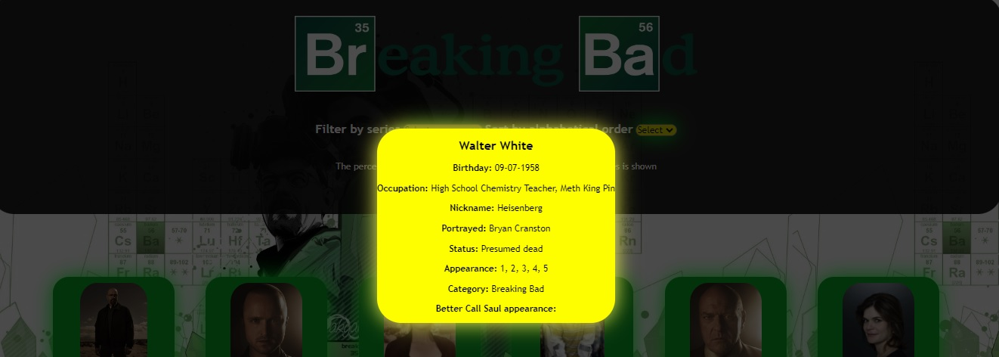
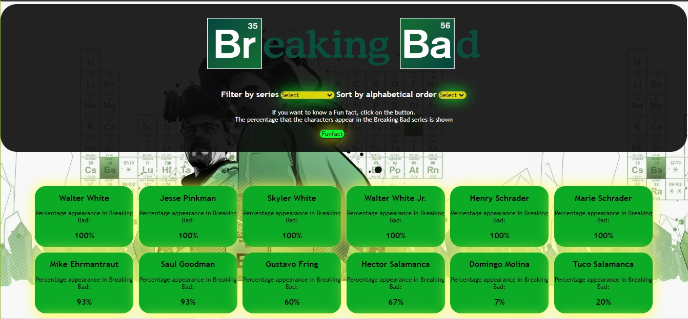

# Data Lovers/Breaking Bad

¡Bienvenida al mundo de Breaking Bad!

Este proyecto tiene el objetivo de mostrarte información sobre los personajes de Breaking Bad y el spin off de la serie, Better Call Saul. Sabemos que, como fan de este universo, te gustaria conocer datos importantes sobre los personajes, desde el cumpleaños del personaje hasta quienes son los actores que los interpretan, por ello hemos desarrollado esta página web para que encuentres todo en un solo lugar.

## Historias de Usuario

Se desarrollaron cuatro historias de usuario de acuerdo con las necesidades de las usuarias.

        Historias de Usuario
        1 - Yo como usuaria quiero poder ver a los personajes de Breaking Bad y Better Call Saul para conocer datos importantes como nombre del personaje, cumpleaños, temporadas en las que aparece, si esta vivo o falleció, su apodo, la serie en la que sale.
        
        Criterios de aceptación: 
        *Los personajes se muestran en tarjetas en forma de cuadrícula.
        *Los personajes contienen el nombre del personaje debajo de la imagen.
        *Al dar click, la tarjeta transicionará a un color obscuro con transparencia para ver la información que contiene la terjeta.
        *Se mostrará la información antes mencionada, al dar click fuera de la terjeta con los datos, esta desaparecerá.

        Definición de terminado:
        *Se presentan todos los personajes que vienen en la base de datos Breaking Bad.js
        *El diseño de la página muestra adecuadamente todos los personajes de forma homogenea y sin detalles que arreglar.
        *Tiene la funcionalidad de mostrar los datos importantes al dar click en todas las tarjetas y las imagenes de los personajes se muestran de un tamaño adecuado al contenedor.

        2- Yo como usuaria quiero poder ordenar los personajes de Breaking Bad y Better Call Saul por nombre de los personajes de forma ascendente (de la A a la Z) y descendente (de la Z a la A).

        Criterios de aceptación: 
        *A través de un input <select> con etiqueta se describe la funcionalidad del elemento que es ordenar.
        *Al dar click en el selector aparecerá el orden en el que se desea ordenar las tarjetas.
        
        Definición de terminado:
        *Se presentan los personajes sin errores en el orden alfabetico.
        *Al dar click en la imagen todavia se muestra el recuadro de información.

        3- Yo como usuaria quiero poder filtrar los persojes por categorías de serie Breaking Bad y Better Call Saul.

        Criterios de aceptación:
        *A través de un input <select> con etiqueta se describe la funcionalidad del elemento que es filtrar.
        *Al dar click en el selector aparecerán las opciones: Todas, Breaking Bad y Better Call Saul para que la usuaria pueda seleccionar la serie deseada.

        Definición de terminado: 
        *Se presentan los personajes sin errores de filtrado.
        *Al dar click en la imagen todavía se muestra el recuadro de la información.

        4- Yo como usuaria quiero poder ver el porcentaje de apariciones de los personajes en todas las temporadas de Breaking Bad

        Criterios de aceptación:
        *Al dar click al botón, a modo de dato curioso aparecerá en cada tarjeta el nombre con el porcentaje de aparicionesen la serie.

        Definición de terminado:
        *Se presentan sin errores en el cálculo matemático los porcentajes
        *Se presentan con el diseño adecuado al CSS de la página.

        
## Diseño de interfaz

Para comenzar se realizó un prototipo de baja fidelidad en Figma donde se muestra a grandes rasgos el funcionamiento y diseño de la página. Se colocaron en tarjetas las imagenes de los personajes con su nombre debajo, todas en forma de cuadrícula.

Se diseñó con la paleta de colores de la serie y utilizando el logo. Una vez lista la primer iteración se elboró la parte responsiva del proyecto como se muestra en la imagen. 

Se desarrolló el CSS de la función de mostrar la información de los personajes utilizando la propiedad box-shadow para darle efecto de flourescencia al recuadro y llamar la atención de la usuaria

Posteriormente en las siguientes iteraciones se modificó el color de fondo y se agregó colores, box-shadow y borde a los botones.

Y para colocar la ultima funcionalidad, se respetó la forma de las tarjetas de los personajes para mostrar los porcentajes de aparición de los personajes en la serie Breaking Bad

## Tests

Se desarrollaron las pruebas unitarias de todas las funciones del proyecto. De acuerdo con el requisito de obtener 70% de statements (sentencias), functions (funciones), lines (líneas), y branches (ramas) del archivo src/data.js, se obtuvo lo siguiente:

Scanned 1 files, no errors found (22 ms).

> data-lovers@1.0.0 test
> jest --verbose --coverage

 PASS  test/data.spec.js
  funcionDeOrdenarDatos
    √ is a function (2 ms)
    √ returns `funcionDeOrdenarDatos` (1 ms)
    √ returns `funcionDeOrdenarDatos` (1 ms)
  filtroCategoriaSerie
    √ is a function
    √ deberia filtrar por serie breaking bad (1 ms)
    √ deberia filtrar por serie Better Call Saul
  promedioBreakingBad
    √ is a function
    √ returns (2 ms)

----------|---------|----------|---------|---------|-------------------
File      | % Stmts | % Branch | % Funcs | % Lines | Uncovered Line #s 
----------|---------|----------|---------|---------|-------------------
All files |   93.75 |    83.33 |     100 |    91.3 | 
 data.js  |   93.75 |    83.33 |     100 |    91.3 | 9,16
----------|---------|----------|---------|---------|-------------------
Test Suites: 1 passed, 1 total
Tests:       8 passed, 8 total
Snapshots:   0 total
Time:        1.046 s, estimated 3 s
Ran all test suites.

Algunos de los problemas que se presentaron al relizar los test fueron la falta de una sentencia que estresara a la función, que nos ayudara a detectar los posibles errores al momento de pasar los argumentos a la función.

